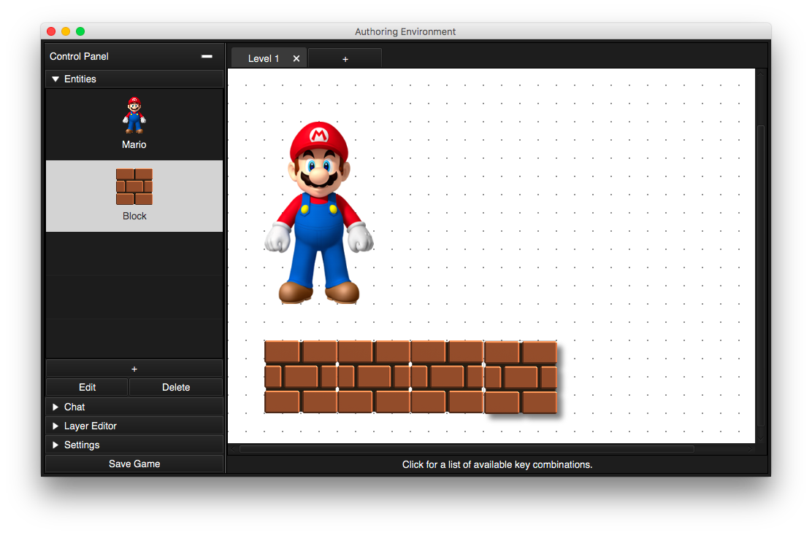

Design Specifications
===========

**Written by:** Elliott Bolzan (eab91), Matthew Barbano (meb100), Jimmy Shackford (jas199), Nikita Zemlevskiy (naz7), Jay Doherty (jld60), Jesse Yue (jty4).

## Introduction

Our team is trying to solve the following problems:
*	Allow a user to create their own platform scroller game through a game authoring environment
*	Allow a user to edit a previously created game
*	Allow a user to play a game that they created

The design/flexibility goals of the project are:
*	Allow future programmers to add new types of field objects
*	Easily allow users to change the actions that occur for each of the following cases:
    *	Mouse interactions (mouse click, drag, move, etc.)
    *	Object collisions from multiple directions (ex. mario collides with a block from the bottom)
    *	Timer expirations (game clock runs out, koopa shell turns into koopa monster after certain amount of time)
*	Easily allow users to save the state of the game
*	Easily allow users to save/load a game they created in the authoring environment
*	Add animations to objects.
*	Add different levels to a game that has already been created.

The closed/open portions of the design architecture are:
*	Open (change these classes to allow for future extensibility): 
    *	Field object inheritance structure so that new ones can be added
    *	Actions (for mouse interactions, object collisions, timer expirations)
    *	The game display in the game player
    *	Game settings
*	Closed (don't need to change these classes to allow for future extensibility):
    *	How the game authoring environment saves/loads a created game
    *	Adding a new element to the game through the authoring environment
    *	Selecting actions in the authoring environment to assign to a certain event
    
The scrolling platformer game genre is one where the screen is focused on a main character, who is in a stage much larger than the screen depicts at a given moment. As the character moves, the screen moves around with the character to depict other parts of the stage. Within the game, there are elements that the main character can interact with (blocks that the user can hit to get power-ups, a floor which the main character can run on, etc.). Moreover, there are certain winning/losing conditions. Our game will need to support interactions between different objects, interactions between the mouse and the field, and the win/lose conditions. Moreover, we will need to design the game to support a screen which moves with the character. In some scrolling platformer games, the background moves at different speeds than the foreground. Thus, we will need to support the addition of multiple foreground/background layers.

At a very high-level, we need to have a game-authoring environment which allows users to create their own games/levels and store them to a file. Then, we need to be able to load these levels and play them within a game player. The game engine determines how the game changes when certain buttons or pressed or certain actions occur.  

## Overview

On the highest level, our project will include the standard four subgroups, each of which contains several modules:
*	Game Authoring Environment
*	Game Engine
*	Game Player
*	Game Data Manager

The Game Player, which will play a game with a configuration that the user has saved, will communicate with the Game Engine to obtain data for running the game. It will not communicate with any other of the four subgroups. The Game Engine will communicate with both the Game Authoring Environment, which will take care of updating the UI, and the Game Data Manager, which will save games that the user has created.

The Game Engine will be divided into the following modules:
*	Game Module– The highest-level module, manages the flow of time, organization of levels, and interaction with the Game Player. It will contain the following classes:
   *	TimingManager - Information about the current time.
   *	PlayerManager - Information about players. Manages their interactions, if multiplayer. See “Player” module below.
   *	GameLoop - Game loop.
   *	LevelManager – Contains a Collection of all existing levels. Responsible for creating/deleting new levels.
   *	Level – Contains classes from Player and Object modules pertaining to that level. Manages interaction between Players and Objects. Will likely be extended into inheritance hierarchy for creation of new types of levels, and each level will be divided into multiple classes. Also contains information about Settings:
        *	Orientation.
        *	Scrolling speed.
        *	Background scrolling speed.
        *	Whether scrolling is determined by character or by game.
*   Player Module – Contains information such a lives left and points earned for the human game player. Does not manage character appearing on screen (allows for games where human can switch between characters).
*	Entity Module. – Anything drawn on the game screen.
    *	GamerControlledEntity – The character(s) controlled by the human player. Separate from the human player (in case can switch between characters), but interacts with the “Player” module. 
    *	ComputerControlledEntity – Anything appearing on screen not controlled by the human player. This includes wall, blocks, and enemies. Divided between those that move (the user will be able to choose left/right, or up/down and the distance), and those that do not.
    *	Background.
    *	Note: For GamerControlledEntity and ComputerControlledEntity, contains inheritance hierarchies for different types. Also attaches Events to each object to handle interactions between Characters and Blocks. Contains a single class for the Background.
*   Event Module (attached to Object). Defined as one of the following:
    *	User input.
    *	Collision (each side, to distinguish between possible ones). 
    *	Timer.
    *	Example: Mario hits a block. The block releases a prize. The block has an event; Mario also has an event.  They each have an event from their own point-of-view.
*	Action Module (attached to Event). – The consequence of each Event. Examples are:
    *	Instantiate new object.
    *	Destroy (character or other object).
    *	Win. 
    *	Lose (life or game).
    *	Bounce (move).
    *	Change image.
    *   Power-up.
    *	Next level.
    *	Make sound.
    *	Movement. – This includes the physics of jumping/gravity.
    *  	Note: Obtains the list of these Actions through reflection.

The GAE will be divided into the following modules (some of which have counterparts in the Game Engine, others of which do not):
* Game Module- counterpart to the Game module in Game Engine
       *	Level – Manages animation relating to JavaFX Objects. Adds the appropriate JavaFX objects to a scene for the level. Likely multiple classes.
       *	More classes/sets of classes will likely be added here.
* Entity Module - counterpart to the Entity module in Game Engine
        *   Contains counterparts for all three categories (Character, Block, and Background) for drawing JavaFX objects.
* Action Module - counterpart to the Action module in the Game Engine
        *	Contains counterparts to ALL of the Game Engine classes in this module for updating the level Scene appropriately.
*	Settings Module – For editing game-wide settings and saving the game to disk.
*	Canvas Module – For visualizing the Entities added to the game and interacting with them. The user should be able to move these Entities around.
*	Entity Module – For creating, displaying, and editing Entities. The user should be able to assign specific Events and corresponding Actions to each created Entitity.
*	Navigation Module – For navigating between levels in the current game. Will most likely be constructed using a tabbed structure.

The Game Player will consist of two modules:
*	I/O Module – For sending user input to the Game Engine and receiving user output from the Game Engine.
*	Play Module – For displaying the game and any auxiliary GUI components. This includes the actual display for the game as well as displays for saving, loading, and seeing high-scores.

The Game Data will consist of the following modules:
*	Input Module
*	Output Module

INSERT DIAGRAM RELATING MODULES HERE    //TODO<------------- (want to wait for things to be more finalized before I draw...)

## User Interface

The User Interface for this project will be composed of three primary units:

1. The Starter Window.
2. The Authoring Environment.
3. The Game Player.

These three units are described below:

1\. **The Starter Window**

2\. **The Authoring Environment**

The Authoring Environment will be further subdivided into three parts:

1. The Settings (on the left in the image below).
2. The Canvas (in the center in the image below).
3. The Entity Panel (on the right in the image below).

- **The Settings**

The **Settings** panel will harbor all game-wide settings. 

These settings may include: the scrolling platformer's orientation, whether the game scrolls automatically or when prompted by the character, the game's song, etc.

In addition, the Settings will contain a `Save` button, that allows for the saving of the designed game to file. 

Generally speaking, this section will only include "traditional" user interface elements: there should be no surprises in how the user should interact with the Settings.

- **The Canvas**

The **Canvas** is the section in which the constructed game will be visualized. 

The **Canvas** will be tabbed: each tab will correspond to one **Level** in the game. Furthermore, any new **Level** should be created as a duplicate of the current **Level**, in order to minimize the user's design time.

The user will be able to add **Entities** to the **Canvas** by clicking on an **Entity** in the **Entity Panel** and then clicking on the **Canvas**. Once the **Entity** is added to the **Canvas**, the user will be able to move it to its appropriate location by dragging it.

Clicking on an existing **Entity** will open it in the **Entity Panel**'s editor.

The **Canvas** should be able to extend infinitely, either horizontally or vertically. This way, the user can create games of any size. 

- **The Entity Panel**

This component's purpose is the creation, display, and editing of **Entities**, the basic building blocks of games. This component is split into two parts: the created entity display, and the entity editor.

The created entity display will show the user which entities have been created, and provide a way for creating new entities. Upon clicking on an entity, the user will be able to click on the **Canvas** to add that entity to the game. 

The entity editor will allow the user to create a new **Entity**. The user should be able to set the type of this new object; its image; and **Events** to which this **Entity** responds, associated to **Actions**. Most of the game's functionality should be created from this subpanel.

*Errors will be indicated to the user through a JavaFX Dialog. Possible errors include*:

- Incorrect parameters when an **Action** is created.
- Incorrect parameters for game-wide settings.
- Seeking to delete the game's only existing level.

3\. **The Game Player**

The Game Player will load a main menu with buttons that are appropriate for the games. It will have 5 options:

1. Back
2. Load Game
3. Highscores
4. Options
5. Game Data

- **Back**
This button just returns to the main starting window, or if in any of the menus it will return to the Game Player starting window.

- **Load Game**
This button leads to a menu of all the available games for the user to select.
Upon selecting a game they will be given the option of starting from the beginning or from a previous save point. 

- **Highscores**
This button leads to a menu of all the highscores in every available game.

- **Options**
This button leads to a menu where the user can adjust things like audio volume, in game controls, etc.

- **Game Data**
This button leads to a menu that holds descriptions of each game. This is a hub that holds useful information for a game, backstory, character data, or anything the game developer wants to include.

Inside the actual game, there will be a toolbar at the top with 5 controls:

1. Exit
2. Save
3. Restart
4. Play/Pause
5. Options

- **Exit**
Exits the game and takes you back to the Game Player main menu. From there the user can load a new game or change

- **Save**
Saves the game into a data file for continued play. Up to 5 saves per game, once there are more than 5 saves the oldest one will be overwritten.

- **Restart**
Restarts the game from the very beginning. Reloads the data file.

- **Play/Pause**
Pauses or plays the game.

- **Options**
Allows user to change settings of the particular game while in the game without going back to the main menu.

## Design Details

## Example Games

## Design Considerations

- Events and actions 
One of the points that was actively discussed by our team was the basic structure of games. The goal was to create a design that was general enough to support many kinds of scrolling platformer games, while being flexible and extensible. We identified that a game can be expressed by several things. Entities (objects that are in the game) and how these `Entity` elements interact. The interaction can be very different depending on what causes it (ie user input vs collision) and can be different per game. Thus, a general but flexible design was created. Interactions, called `Action`s will be triggered by `Event`s. Thus, an `Entity` owns a number of `Events`, which trigger their respective `Actions` when they occur. Examples of this can be seen in the use cases for the game engine. This is a flexible design, as it accounts for many aspects of games at once. This way, user input, collisions, clock events can all be some kind of `Event` in that hierarchy. If an extendor needs to add a new kind of event games might want to respond to, one would just extend the `Event` superclass. The `Action` hierarchy is flexible and extensible in a similar way. `Action`s could be winning a game, releasing a powerup (if the object is block), dying, etc. It is equally easy to add new `Action`s to the game engine if desired.

- Where to keep JavaFX Nodes 
Another point of discussion of our whole team was where to keep and generate JavaFX Nodes. Our initial idea was to have JavaFX Nodes stored or generated inside of every `Entity`. The advantage of this design is that no outside classes would have to know about the inner workings of each `Entity`. An initial idea about this design was that there would be less code duplication, since otherwise both the authoring environment and the gameplay environment would have to make their own JavaFX  Nodes representing the `Entity` objects. The design our group chose in the end was to make a `NodeFactory` class, which would generate JavaFX Nodes out of `Entity` objects. Utilizing the Factory design pattern we were able to avoid mixing backend and frontend code, which seemed like a bad idea from the start. Additionally, we could add functionality that is needed for these nodes specifically for the authoring environment and gameplay environment after the nodes have been already generated by the `NodeFactory`. For example, if we need to add `onClick` functionality for the authoring environment but not for the gameplay, we can do that after making the node. This design streamlined the creation and transformation of `Entities` to nodes.

- How much responsibility to give the Player (related to the above) 
Our team discussed how much functionality to embed in the player. At first, our idea was to generate all JavaFX components in the game engine. Under this design, the Player (the gameplay environment, not the user) would only have play, pause, and other such functionality. However, this seemed like an unreasonable distribution of responsibility due to the reasons outlined above. In order to avoid mixing backend and frontend code as much as possible, our team opted for a design that gave more functionality to the Player. Now, the Player is responsible for getting the JavaFX Nodes from the `NodeFactory` and placing them correctly in the visualization. In addition to the responsibilities the Player had before, it has to also talk to the `Game` in the game engine about running the game and receive updates that resulted from the screen scrolling, from user input, and from gameplay collisions. This design will result in a cleaner, more closed and more organized code. Separating the model from the view according to the MVC design pattern is one of the goals of this project's design.

- Where to do creation of entities 
There was a question about where to create the entities. There are two options. Either the `Entity` objects that make up levels in the game will be created directly by the authoring environment when a user is making a game and when a game is being loaded from a saved file, or the `Entity` objects can be created in the game engine by a `EntityFactory`, and the authoring environment and the game data loader will just call a method `getEntity` in the `EntityFactory` when these components identify that an `Entity` is required. The second design was chosen initially, for the reason of avoiding duplicated code. The disadvantage of the first design is that the authoring environment and game data loader would contain similar functionality, which is avoided through the second design. A possible disadvantage of the second design is that it requires passing strings to the game engine, which could lead to magic values in the code. However, the use of reflection will solve that problem and both reduce the `if` statements in the `EntityFactory` code, and will streamline the creation of `Entity` objects when a string is given. However, after a class lecture, we realized that the `Entity` objects would be serialized by xstream in our design. This would enable easy saving, loading and creating of `Entity` objects. Thus, the creation for `Entity` objects in the authoring environment and the game data is not very similar, as one has to create objects from scratch, while the other has to load serialized objects through xstream. Because of this, the first design was chosen in the end.

- Should `Action`s and `Event`s have parameters 
A point of debate was whether actions and events have parameters, or whether there should be a separate action and event for every possible parameter. The original design was following the latter idea, where `Action` and `Event` would be subclassed numerous times to capture all possible combinations of user input when creating games (within reasonable bounds, for instance). However, this design was quickly debunked when the idea of the timer being an `Event` that triggers an `Action` (which would work according to our flexible design of `Action`s and `Event`s) was brought up. This design would require creating an event for every possible millisecond to allow the user to select any amount of time as the maximum amount for a level that is being created. This was absurd, and the point was proven that `Action` and `Event` instances should have parameters. For example, when the user clicks the up arrow, there should be an option of how much to move the character (if the move up `Action` is selected). This has implications for communicating between the authoring environment and the game engine as well, as the authoring environment needed a way to see all of the parameters that needed to be set for a given `Action` or `Event`. This was solved by providing `getParams` and `setParams` methods in both classes. This design is the better one, as it is more extensible and flexible, and will surely result in much less code duplication and clutter.

- How should the `Player` get access to the JavaFx Node objects and how will they be updated? 
Our group discussed two different options for having the `Player` receive the JavaFx Nodes and how they will be updated on every step of the game. The first and most primitive idea that could have worked was for the `Player` to call the `NodeFactory` on every single step of the game and replace the JavaFx Nodes that existed in the Scene with the new ones. These new ones would get the updated positions from the game engine, and the game would thus be moving. However, this would require the regeneration of the same nodes every single step just with new locations. This seemed like a poor choice to us, and a new design was chosen. Under this new design, we would only generate the JavaFx Node objects from `NodeFactory` once. The locations and images and all other necessary properties of these nodes will be binded using bindings to the locations and other vital properties of the `Entity` objects. These JavaFx Nodes will be then placed in the scene and will update automatically. Doing so eliminates having to update on every step and create new JavaFx Nodes. Only the game engine has to know about the stepping of the game, the `Player` just has to place the nodes properly in the scene, and that's it.
